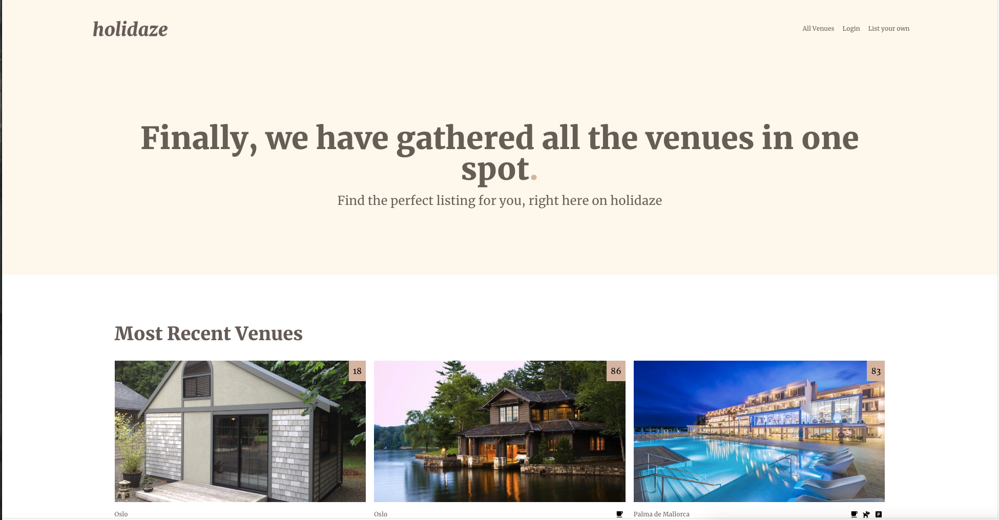

# Holidaze



This project was an exam at Noroff. It's a website where you can add you venues and people can book the venue if they like it. The project uses the Noroff API v2.

## Description

The homepage has a big hero section which looks really appealing when you open the site, and straight from there you can browse recent venues. On the homepage there is also a grid with venues where you can explore other venues aswell. 

There is also a auth system that lets you register or login, you can also register as a venuemanager so  you can post your own venues. You are also allowed to browse venues, but not book them, if you are not logged in.

Additional functionality includes a calendar with availability for that specific venue every single day indefinetely. 


## Built With

This project was built on react.js and tailwind CSS. It also use Noroff API v2

- [React.js](https://reactjs.org/)
- [TailwindCSS](https://tailwindcss.com)
- [NoroffAPI](https://docs.noroff.dev/docs/v2)

## Getting Started

### Installing

1. Clone the repo:

```bash
git clone git@github.com:bettytro/exam.git
```

2. Install the dependencies:

```
npm install
```

### Running

To open a development server, run the following command:

```bash
npm run start
```

To build a stable build before deploying: 

```bash
npm run build
```


## Contributing

If you want to contribute, you are more than welcome. Add a PR, and I will look into it and merge if I find it interesting. I appreciate you contributing to my project, and will be forever thankful.

## Contact

You can contact me at elisabeth@darkwoodmedia.no

